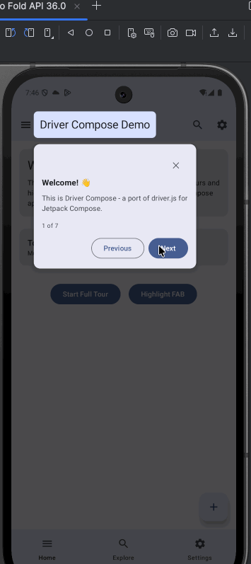

# Driver Compose

[](https://opensource.org/licenses/MIT)
[](https://android-arsenal.com/api?level=28)
[](https://kotlinlang.org)
[](https://developer.android.com/jetpack/compose)

A lightweight Jetpack Compose library for creating beautiful user onboarding experiences, feature highlights, and contextual help. Inspired by [driver.js](https://driverjs.com).

<p align="center">
  
</p>

## Features

- 🎯 **Highlight any composable** - Focus user attention on specific UI elements
- 🚀 **Product tours** - Create multi-step onboarding experiences
- 💬 **Rich popovers** - Customizable tooltips with title, description, and buttons
- ✨ **Smooth animations** - Animated spotlight transitions
- 🎨 **Highly customizable** - Colors, padding, radius, button text, and more
- 📱 **Compose-native** - Built specifically for Jetpack Compose

## Installation

Add the dependency to your app's `build.gradle.kts`:

```kotlin
dependencies {
    implementation("id.yuana:driver-compose:1.0.0")
}
```

> **Note:** This library is not yet published to Maven Central. For now, include the `driver-compose` module directly in your project.

## Quick Start

### 1. Create a Controller

```kotlin
val driverController = rememberDriverController(
    config = DriverConfig(
        animate = true,
        showProgress = true
    )
)
```

### 2. Mark Elements to Highlight

```kotlin
Text(
    text = "Welcome!",
    modifier = Modifier.driverTarget(driverController, "welcome-text")
)

Button(
    onClick = { /* ... */ },
    modifier = Modifier.driverTarget(driverController, "action-button")
) {
    Text("Click Me")
}
```

### 3. Add the Driver Overlay

Place this at the root of your composable tree:

```kotlin
Box {
    // Your app content here
    
    // Driver overlay (must be last to appear on top)
    Driver(controller = driverController)
}
```

### 4. Start a Tour

```kotlin
driverController.drive(
    listOf(
        DriveStep(
            targetId = "welcome-text",
            popover = PopoverConfig(
                title = "Welcome! 👋",
                description = "This is the first step of the tour."
            )
        ),
        DriveStep(
            targetId = "action-button",
            popover = PopoverConfig(
                title = "Action Button",
                description = "Click this button to perform an action.",
                side = PopoverSide.TOP
            )
        )
    )
)
```

### Or Highlight a Single Element

```kotlin
driverController.highlight(
    DriveStep(
        targetId = "action-button",
        popover = PopoverConfig(
            title = "New Feature!",
            description = "Check out this awesome new button."
        )
    )
)
```

## Configuration

### DriverConfig

Global configuration passed to `rememberDriverController()`:

| Property | Type | Default | Description |
|----------|------|---------|-------------|
| `animate` | Boolean | `true` | Enable/disable animations |
| `overlayColor` | Color | `Color.Black` | Backdrop overlay color |
| `overlayOpacity` | Float | `0.5f` | Overlay opacity (0-1) |
| `stagePadding` | Dp | `10.dp` | Padding around highlighted element |
| `stageRadius` | Dp | `5.dp` | Corner radius of highlight cutout |
| `allowClose` | Boolean | `true` | Allow closing by clicking overlay |
| `showProgress` | Boolean | `false` | Show step progress (e.g., "2 of 5") |
| `showButtons` | List | `[NEXT, PREVIOUS, CLOSE]` | Buttons to show |
| `nextBtnText` | String | `"Next"` | Next button text |
| `prevBtnText` | String | `"Previous"` | Previous button text |
| `doneBtnText` | String | `"Done"` | Done button text (last step) |

### PopoverConfig

Per-step popover configuration:

| Property | Type | Default | Description |
|----------|------|---------|-------------|
| `title` | String? | `null` | Popover title |
| `description` | String? | `null` | Popover description |
| `side` | PopoverSide | `BOTTOM` | Position: `TOP`, `RIGHT`, `BOTTOM`, `LEFT` |
| `align` | PopoverAlign | `CENTER` | Alignment: `START`, `CENTER`, `END` |
| `customContent` | Composable? | `null` | Custom popover content |

## API Reference

### DriverController

| Method | Description |
|--------|-------------|
| `drive(steps)` | Start a multi-step tour |
| `highlight(step)` | Highlight a single element |
| `moveNext()` | Go to next step |
| `movePrevious()` | Go to previous step |
| `moveTo(index)` | Go to specific step |
| `destroy()` | End the tour/highlight |
| `isActive()` | Check if driver is active |
| `hasNextStep()` | Check if next step exists |
| `hasPreviousStep()` | Check if previous step exists |
| `getState()` | Get current driver state |
| `setConfig(config)` | Update configuration |

### Callbacks

Add callbacks to `DriverConfig` or `DriveStep`:

```kotlin
DriverConfig(
    onHighlightStarted = { step -> /* Called before highlighting */ },
    onHighlighted = { step -> /* Called after highlighting */ },
    onDeselected = { step -> /* Called when step is deselected */ },
    onNextClick = { step -> /* Called on next button click */ },
    onPrevClick = { step -> /* Called on previous button click */ },
    onCloseClick = { step -> /* Called on close button click */ },
    onDestroyed = { /* Called when tour ends */ }
)
```

## Advanced Usage

### Custom Popover Content

```kotlin
DriveStep(
    targetId = "custom-element",
    popover = PopoverConfig(
        customContent = {
            Column(modifier = Modifier.padding(16.dp)) {
                Text("Custom Content!", style = MaterialTheme.typography.titleLarge)
                Spacer(modifier = Modifier.height(8.dp))
                Image(painter = painterResource(R.drawable.tutorial), contentDescription = null)
                Button(onClick = { driverController.moveNext() }) {
                    Text("Got it!")
                }
            }
        }
    )
)
```

### Overlay Click Behavior

```kotlin
DriverConfig(
    overlayClickBehavior = OverlayClickBehavior.Close,      // Default: close tour
    // or
    overlayClickBehavior = OverlayClickBehavior.NextStep,   // Move to next step
    // or
    overlayClickBehavior = OverlayClickBehavior.Custom { step ->
        // Custom behavior
    }
)
```

### Using DriverScope

Convenience wrapper that includes the Driver overlay:

```kotlin
val controller = rememberDriverController()

DriverScope(controller = controller) {
    // Your content here - no need to add Driver separately
    Text(
        text = "Hello",
        modifier = Modifier.driverTarget(controller, "greeting")
    )
}
```

## Comparison with driver.js

| driver.js | driver-compose |
|-----------|----------------|
| `driver(config)` | `rememberDriverController(config)` |
| `element: '#id'` | `Modifier.driverTarget(controller, "id")` |
| `driverObj.drive()` | `controller.drive(steps)` |
| `driverObj.highlight()` | `controller.highlight(step)` |
| `driverObj.moveNext()` | `controller.moveNext()` |
| `driverObj.destroy()` | `controller.destroy()` |

## Sample App

Check out the [demo app](/app) for a complete example with:
- Multi-step product tour
- Single element highlighting  
- Various popover positions
- Different UI components

## Requirements

- Android API 28+
- Jetpack Compose BOM 2024.09.00+
- Kotlin 2.0+

## License

```
MIT License

Copyright (c) 2024 Yuana Andhika

Permission is hereby granted, free of charge, to any person obtaining a copy
of this software and associated documentation files (the "Software"), to deal
in the Software without restriction, including without limitation the rights
to use, copy, modify, merge, publish, distribute, sublicense, and/or sell
copies of the Software, and to permit persons to whom the Software is
furnished to do so, subject to the following conditions:

The above copyright notice and this permission notice shall be included in all
copies or substantial portions of the Software.

THE SOFTWARE IS PROVIDED "AS IS", WITHOUT WARRANTY OF ANY KIND, EXPRESS OR
IMPLIED, INCLUDING BUT NOT LIMITED TO THE WARRANTIES OF MERCHANTABILITY,
FITNESS FOR A PARTICULAR PURPOSE AND NONINFRINGEMENT. IN NO EVENT SHALL THE
AUTHORS OR COPYRIGHT HOLDERS BE LIABLE FOR ANY CLAIM, DAMAGES OR OTHER
LIABILITY, WHETHER IN AN ACTION OF CONTRACT, TORT OR OTHERWISE, ARISING FROM,
OUT OF OR IN CONNECTION WITH THE SOFTWARE OR THE USE OR OTHER DEALINGS IN THE
SOFTWARE.
```

## Credits

Inspired by [driver.js](https://driverjs.com) by [Kamran Ahmed](https://twitter.com/kamrify).

## Contributing

Contributions are welcome! Please feel free to submit a Pull Request.

1. Fork the repository
2. Create your feature branch (`git checkout -b feature/amazing-feature`)
3. Commit your changes (`git commit -m 'Add some amazing feature'`)
4. Push to the branch (`git push origin feature/amazing-feature`)
5. Open a Pull Request
